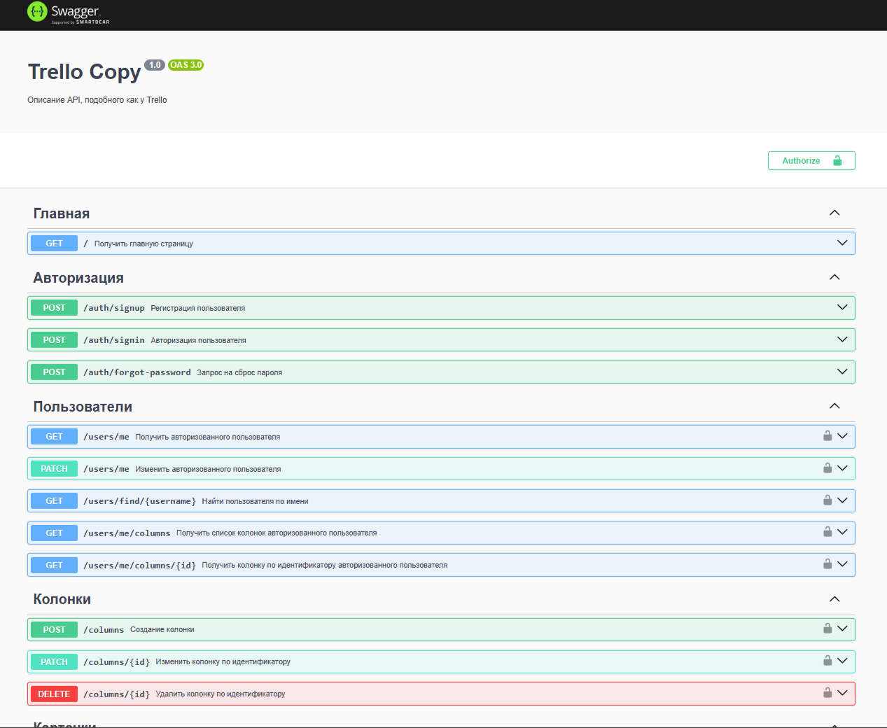

# Trello Copy

## Задачи:

1. Создать RESTful API с авторизацией для trello (trello.com) на nestjs (https://docs.nestjs.com/);
2. Реализовать функционал, схожий с trello;
3. Спроектировать структуру БД при помощи https://dbdiagram.io;
4. Описать документацию с помощью swagger;

### Ссылка на реализованную структуру

[dbdiagram](https://dbdiagram.io/d/backend-test-task-similar-to-trello-Diagram-66bf763f8b4bb5230e511f1a)

### Запуск:

```bash
yarn run start:dev # в dev-режиме
yarn run start:prod # в prod-режиме
```

- чтобы воспользоваться документацией Swagger перейдите по маршруту http://localhost:3000/api/docs


